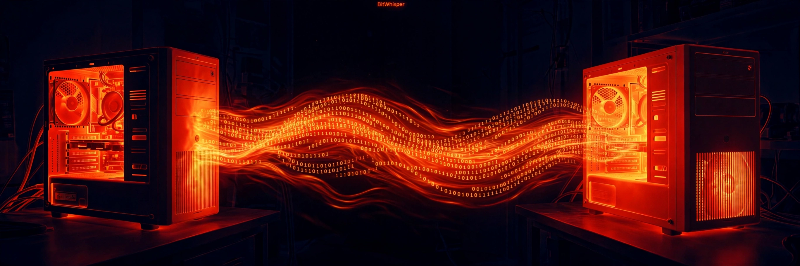

# BitWhisper — Covert Thermal Signaling Channel



Implementation of Guri et al., *"BitWhisper: Covert Signaling Channel between
Air-Gapped Computers using Thermal Manipulations"* ([arXiv:1503.07919](https://arxiv.org/abs/1503.07919)).

The paper shows two nearby air-gapped computers can communicate by heating
the air with CPU/GPU load and reading the neighbor's built-in thermal
sensors: ~1–8 bits/hour over 0–40 cm. The public draft omits Section VI (the
modulation/protocol details), so the modem here is an original design
dimensioned from the paper's measured channel constraints.

## Layout

```
projects/bitwhisper/
├── paper.pdf                 # the original paper
├── bitwhisper/
│   ├── physics.py            # thermal channel simulator
│   ├── modem.py              # Manchester modem + framing
│   ├── protocol.py           # thermal ping, half-duplex transfer + ACK
│   └── hw.py                 # real hardware: Linux thermal zones + CPU burner
└── tests/
    ├── test_physics.py       # simulator vs paper measurements
    ├── test_modem.py         # framing, CRC, modulation
    └── test_e2e.py           # full TX→channel→RX transfers
```

## Physics model (`physics.py`)

Three stages: **Transmitter** → **air gap** → **Receiver**.

- **Transmitter** has two thermal paths: a fast convective path (exhaust air,
  τ≈1 min) and a slow conductive path (chassis, τ≈8/18 min heat/cool).
- **Air gap**: advective dead-time + local mixing lag. The paper's
  "0.35 min/cm propagation delay" (Sec V.B.2) is split between them.
- **Receiver**: ambient motherboard sensor with τ≈2 min lag, 1°C
  quantization, noise, and slow room-temperature drift.

Calibration targets taken from the paper (parallel layout, ~0 cm):
+1°C after ~3 min of full load, +4°C after 26 min. Attenuation is
exponential in distance; the channel is effectively dead past ~40 cm.

## Modem (`modem.py`)

Why Manchester instead of plain on-off keying: the transmitter's slow
(chassis) path has a time constant of ~8–18 min, so at 7.5-min symbols OOK
suffers crushing inter-symbol interference — a `0` right after a `1` still
reads hot. Manchester fixes this two ways:

- **constant 50% duty cycle** → the slow path settles to a flat baseline
  regardless of the data (zero ISI by construction);
- the bit decision **compares the two half-slots within one bit period**,
  so baseline wander and room drift cancel out — no adaptive threshold.

Bit `1` → [heat, idle], bit `0` → [idle, heat], over a 7.5-minute bit
period = **8 bits/hour**, the paper's rate.

Frame format: 16-bit alternating preamble (acquisition) + 8-bit payload
length + payload + CRC-8, all Manchester-encoded, preceded by an idle
guard for the receiver baseline.

Receiver pipeline: preamble acquisition via a ripple-onset energy detector
plus a detrended template matched-filter (template generated from the
physics model), lag calibration, then per-bit half-slot comparison.

## Protocol (`protocol.py`)

- `thermal_ping()` — heat pulse + neighbor detection (rise threshold
  above drift/quantization).
- `HalfDuplexLink` — send a payload one direction, get an ACK/NACK back
  the other, with retries. The paper's channel is asymmetric (Sec V.B.3),
  so each direction gets its own channel parameters.

## Running it

```bash
cd projects/bitwhisper
PYTHONPATH=. python3 tests/test_physics.py
PYTHONPATH=. python3 tests/test_modem.py
PYTHONPATH=. python3 tests/test_e2e.py
```

Demo (simulated 10 cm transfer):

```bash
PYTHONPATH=. python3 demo.py --payload "hi" --distance 10
```

Real hardware (`hw.py`): discovers `/sys/class/thermal` zones, picks the
best ambient sensor, and can burn CPU with duty-cycle modulation.
Requires two nearby bare-metal machines with readable thermal sensors —
this VM exposes no thermal zones, so hardware testing is untested.

## What's simulated vs. real

Simulated and verified: physics anchors, framing/CRC, acquisition,
decoding under noise+drift at 0–10 cm, out-of-range rejection, ping
near/far behavior, half-duplex ACK transfers.

Not validated: real hardware. The thermal timing, quantization, and
sensor behavior all come from the paper and this simulator; a real
two-machine test is needed before trusting the timing margins.
